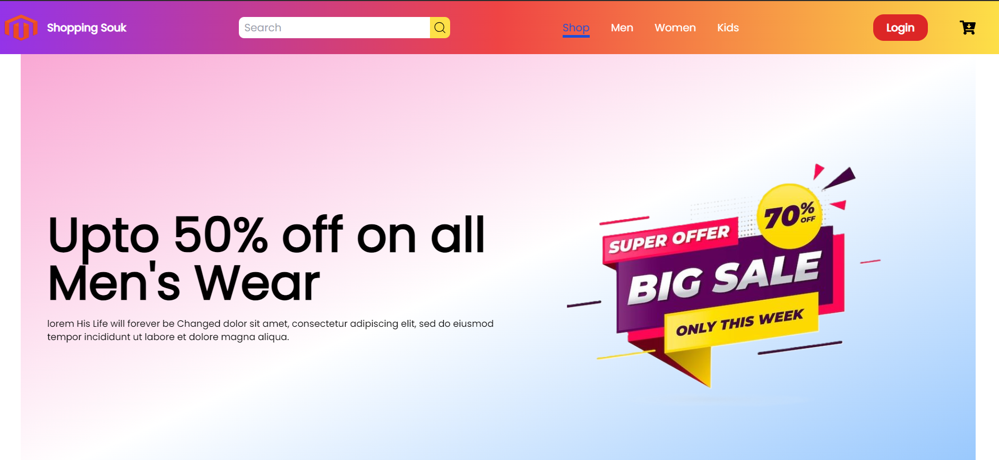

# E-Commerce Website

Welcome to our E-Commerce Website! This project is a modern and responsive e-commerce platform built using ReactJS, React-DOM, React Router DOM, Tailwind CSS, and AOS animations. It offers a seamless shopping experience for users and provides a robust foundation for building an online store.

## Features

- [Home Page](#): The landing page showcases featured products and promotions to captivate visitors and encourage exploration.
- [Men's Section](#): Explore a wide range of men's clothing, footwear, and accessories tailored to modern trends and styles.
- [Women's Section](#): Discover an extensive collection of women's apparel, shoes, and accessories designed for fashion-forward individuals.
- [Kids' Section](#): Browse through adorable and practical clothing and accessories for kids of all ages, from infants to pre-teens.
- [Cart Section](#): Manage your shopping cart effortlessly, review items, update quantities, and proceed to checkout with ease.

## Technologies Used

- [ReactJS](https://reactjs.org/): A powerful JavaScript library for building dynamic user interfaces with reusable components.
- [React-DOM](https://reactjs.org/docs/react-dom.html): Provides rendering capabilities for React components in the browser.
- [React Router DOM](https://reactrouter.com/web/guides/quick-start): Enables declarative routing and navigation within the application.
- [Tailwind CSS](https://tailwindcss.com/): A highly customizable CSS framework that facilitates rapid UI development with utility classes.
- [AOS](https://michalsnik.github.io/aos/): AOS library adds stunning animations to elements as they enter the viewport, enhancing user experience.

## Demo

Check out the [demo](https://ecommerce-website-phi-ten.vercel.app/) to see the E-Commerce Website in action!

## Screenshot



## Installation

1. **Clone the repository:**

   ```bash
   git clone https://github.com/yourusername/e-commerce.git
   ```
